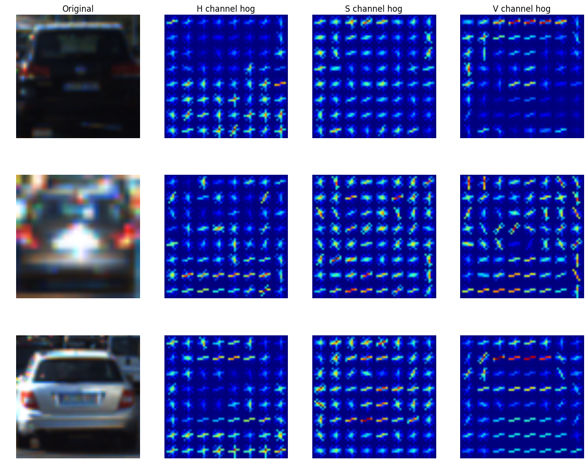
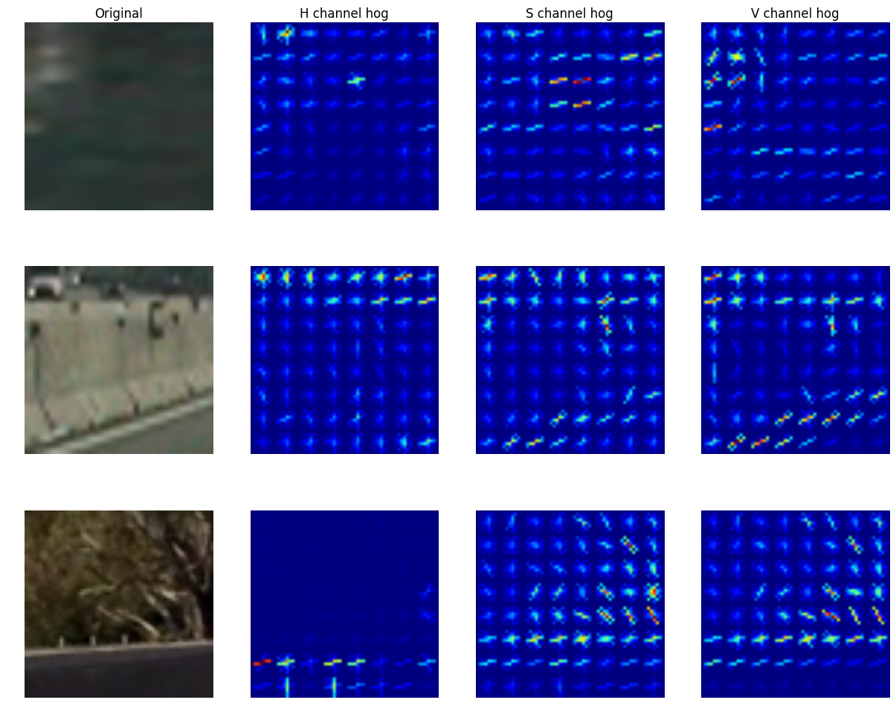
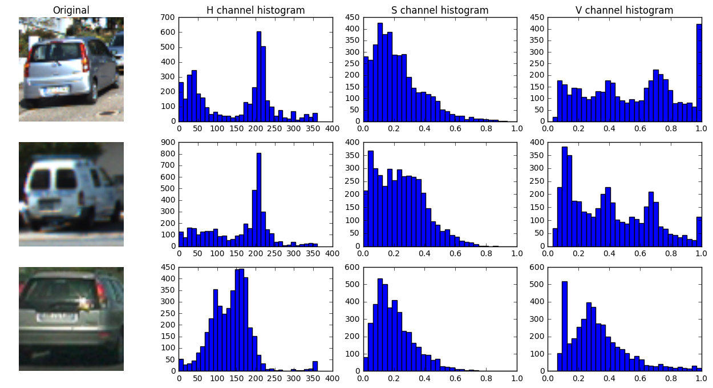
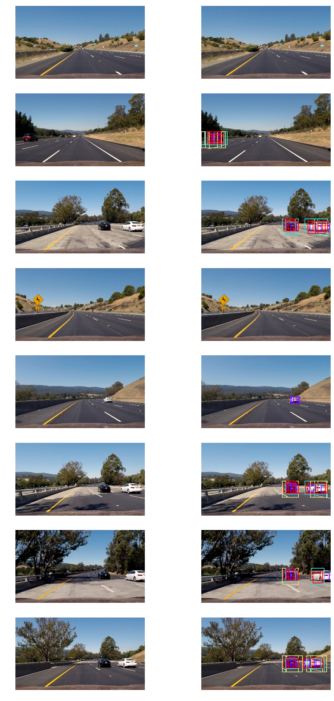

## Vehicle Detection and Tracking

In this project, our goal is to write a software pipeline to identify vehicles in a video and apply a tight bounding box around each vehicle detected. Following steps were implemented to acheive the goal :

* Perform a Histogram of Oriented Gradients (HOG) feature extraction on a labeled training set of images and train a linear SVM classifier
* Additionally, apply a color transform and append binned color features, as well as histograms of color, to HOG feature vector.
* Implement a sliding-window technique and use trained classifier to search for vehicles in images.
* Run the pipeline on a video stream  and create a heat map of recurring detections frame by frame to reject outliers and follow detected vehicles.
* Estimate a bounding box for vehicles detected.

The project consists of following files : 

* `Project.ipynb` : IPython notebook with step-by-step description, implementation and execution of entire code. 

--

### Data 
I have used dataset labeled as [vehicles](https://s3.amazonaws.com/udacity-sdc/Vehicle_Tracking/vehicles.zip) and [non-vehicles](https://s3.amazonaws.com/udacity-sdc/Vehicle_Tracking/non-vehicles.zip) for this project. These images come from three sources : [GTI vehicle image database](http://www.gti.ssr.upm.es/data/Vehicle_database.html), [KITTI vision benchmark suite](http://www.cvlibs.net/datasets/kitti/) and a video from [Udacity](https://github.com/udacity/CarND-Vehicle-Detection/blob/master/project_video.mp4). Sample images from vehicles and non-vehicles are shown below  :

**Vehicles**

**Non-vehicles**

The two classes have roughly the same number of images resulting in a balanced dataset. However there is one issue : it turns out that many of the images in the dataset were taken in quick succession resulting in very similar images. Consequently, randomly splitting data into train and test sets will result in highly correlated images between the two datasets. To remedy this problem, I have made sure that images from same track do not end up in both training and test sets (see code cell 6 of `Project.ipynb`). The test data size is fixed to 20% of the full dataset.  

--

###  Histogram of Oriented Gradients (HOG)
`skimage.hog()` function was used to extract HOG features. There are a number of HOG parameters that can be tuned. Three of these parameters determine the size of the feature vector : number of pixels per cell `pixels_per_cell`, number of cells per block `cells_per_block` and number of orientations `orientations`. While a large feature vector in general carries more information, not all information may be useful for classification. From practical point of view, having too fine a grid or too many cells per block will reduce computational speed. Given that we have 64x64 images, a grid size of 8x8 (i.e. 8 pixels per cell) and 2x2 cells per block seems like a reasonable choice and amounts to 196 features per color channel per orientation. I used all three color channels as it gave a higher test prediction score. Here are a few examples showing HOG features using HSV colorspace with `orientations=9`, `pizels_per_cell=(8,8)` and `cells_per_block=(2,2)`  :

**Vehicles**

**Non-vehicles**

As seen above, gradient information is adequately captured and at the same time I found that speed is not compromised. I explored a number of colorspaces : RGB, HSV, HLS, YUV, YCrCb and LUV. Visually, it was obvious that HOG features for vehicles and non-vehicles look different as shown above. However, to quantify the difference for different colorspaces I ran linear SVM classifier for each colorspace and found that YUV colorspace had the highest test set accuracy. It should be pointed out that all colorspaces had similar scores except RGB which had lower score than the rest. A similar grid search was used to find the optimal number of orientation bins which I found to be 11 although 10 would not have been a bad choice either. Implementation details of HOG features and parameter tuning can be found in code cells 8-15 of `Project.ipynb`     

--

### Color features
Two types of color features are considered : 

* Spatial binning of color channels
* Histogram of color channels 

Here are some examples of color histograms using HSV colorspace for *vehicles* and *non-vehicles* datasets suing 32 bins :

**Vehicles**

**Non-vehicles**
  

From the plots above, it is clear that color features can be very useful. While spatial binning alone does not have much discriminating power, but when used along with HOG features and color histograms did improve the performance. So, I included both spatial binning and color histograms along with HOG features in the feature vector.   

There are two parameters to be tuned : number of spatial bins and number of histogram bins. Again I performed a grid search to determine the optimal number. I found that using less than 32 histogram bins significanty degrades test scores. On the other hand, changing the number of spatial bins has a minor affect on performance. In the end, I have used 64 color histogram bins and 32 spatial bins to get the best prediction scores. Test set performance for several colorspaces were explored. In the end, I chose YUV colorspace as it performed reasonably well for both HOG and color features. Implementation details of HOG features and parameter tuning can be found in code cells 16-23 of `Project.ipynb`.   

--

### Linear SVM classifier

HOG, color histogram and spatial features were combined into a single 1-D *feature vector* using parameters determined before. Here, I summarize the parameters again :

* *colorspace = YUV*
* *orientations = 11*
* *pixels per cell = (8,8)*
* *cells per block = (2,2)*
* *color histogram bins = 64 per color channel*  
* *spatial bins = (32,32)*

Features were normalized using `sklearn.preprocessing.StandardScaler()`.
I explored colorspaces for the combined feature vector. YUV still gives the best overall test scores. Further, cross-validation was used to determine the penalty parameter 'C' in the linear SVM classifier. Test set accuracy of **99.8%** was obtained. Please see code cells 24 and 25 of `Project.ipynb` for details.

--

### Sliding window

Next, sliding-window technique is used to find cars in video frames using the trained classifier from above (code cells 26 and 27 of `Project.ipynb`). Only region below the horizon is selected for searching vehicles. Four scales were chosen, each with their own search area :

| Scale			| y-range		|
| ------------- |:-------------:|
|  1.0			| (380,508)		|
|  1.5  		| (380,572)		| 
|  2.0  		| (380,636)		| 
|  2.5 			| (380,700)		| 
where default `scale=1.0` corresponds to window size of 64x64 pixels. Note that `y=380` is approximately the horizon position. 

Using sliding windows with the four scales (each scale shown with a different color) and parameters described above, here are the results on some test images :

 

--

### Heatmaps and video implementation
After positive detections in each image, the last step is to combine the detections to actually identify vehicle locations. For this step,  I created a heatmap and then thresholded that map to identify vehicle positions.  `scipy.ndimage.measurements.label()` function was used to identify individual blobs in the heatmap. Under the assumption that each blob corresponds to a vehicle, I constructed bounding boxes to cover the area of each blob detected. (See code cells 28 and 29 of `Project.ipynb` for implementation). 

Here's an example result showing heatmap using `theshold=2` on individual test images, followed by the resulting bounding boxes :

 

To make the video implementation more robust against false positives, a slight modification of above procedure is implemeted :

* First, the sliding window technique is applied to each frame of the video and the resulting detections upto 25 frames (or 1 second) are stored in memory.  
* Heatmap is constructed using the last 25 frames and a `threshold=8` is applied. 
* Using `scipy.ndimage.measurements.label()`, blobs in the heatmap from last step are identified as vehicles and bounding boxes drawn. 
* Updates to the heatmap are performed every 2 frames. If a vehicle was detected in previous update, a small bias in the heatmap is applied at the positions where vehicles were last detected.    

To accomplish the above task, I have written a class `vehicle detection` which can found in code cell 30 of `Project.ipynb`.  

Here's a link to my final video result :

### Discussion
A challenging aspect of this project was dealing with false positives. This required some experimentation with choosing the right thresholds for heat maps, the number of frames to smooth over and even selecting the right feature space for classifier. However, there are a number of limitations in the current implementation and significant scope for improvement :

* Firstly, a large portion of `non-vehicles` dataset was chosen from project video. It would be interesting to see if the classifier works just as well on other videos.  
* Currently, the feature vector is very large (~9k). It might be a good idea to select fewer features, using decision trees. 
* Hard negative mining could be used to further reduce false positives. 
* Another limitation of current implementation is that the target area for sliding window search is not very robust. In particular, when I applied the algorithm to images where horizon position is different, many more false positives were detected. A more robust algorithm should take the horizon problem into account.
* By recording the change in position of vehicle over several frames, it should be possible to predict future location which could facilitate detection further. Currently, this information is not used. 
* Lastly, an obvious direction to improve classifier accuracy is to use neural networks.    